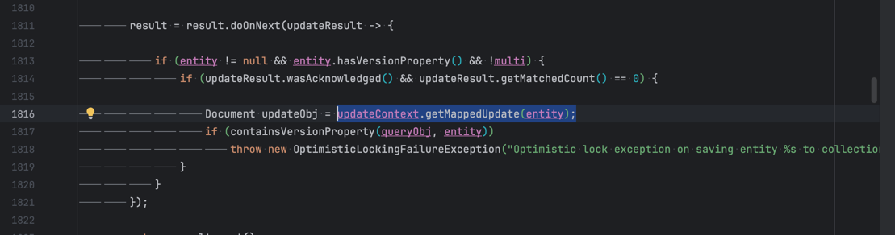

# How to reproduce issue: https://github.com/spring-projects/spring-data-mongodb/issues/4097
 
1. Prepare env: execute `docer compose up -f ./env/docker-compose.yaqml -d`
2. Run test class: [OptimisticLockingWithAggregationUpdateApplicationTests](src/test/java/systems/ajax/optimistinglockicwithaggregationupdate/OptimisticLockingWithAggregationUpdateApplicationTests.java)
3. Verify update query using simple `Update` returns expected `OptimisticLockingFailureException`. 
But same update using `AggregationUpdate` fails due to unexpected `IllegalArgumentException`.
When it tries to get `MappedUpdate` object if there were no matched documents during update execution.
See in `ReactiveMongoTemplate`:

